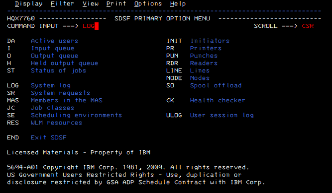
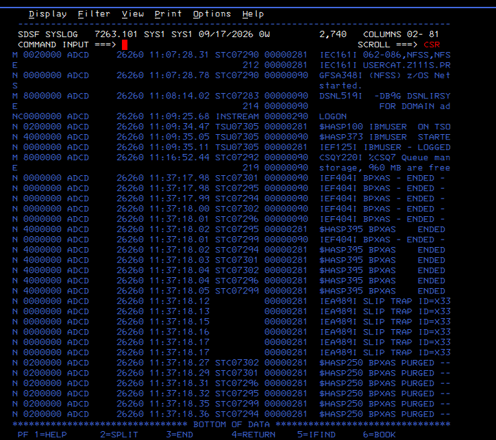
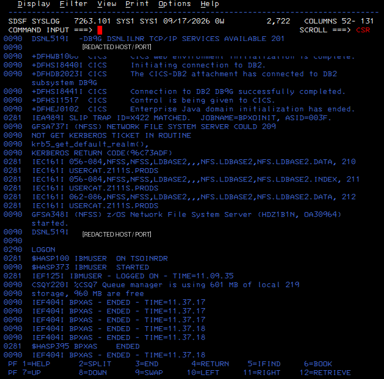
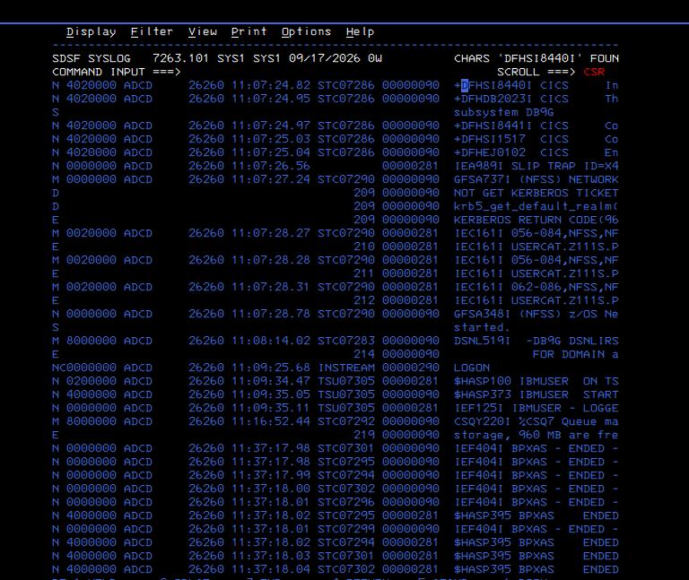
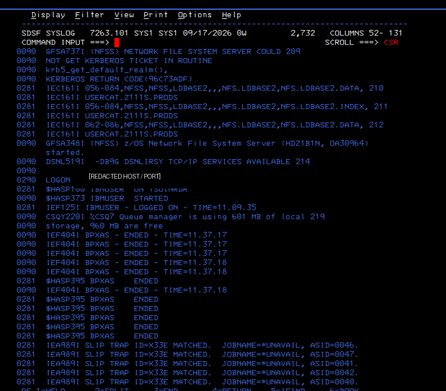
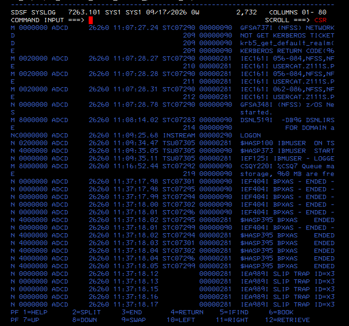
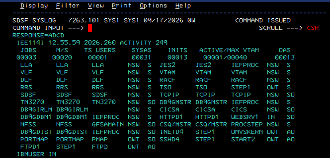
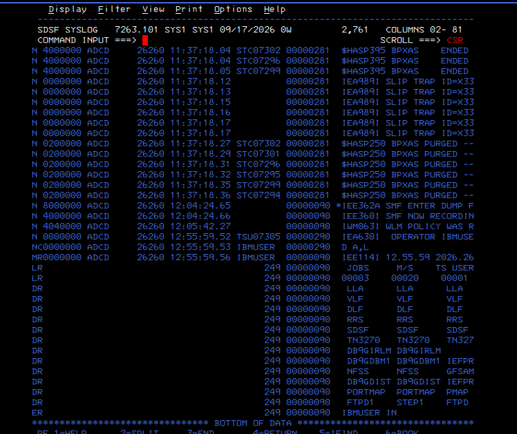

# Guided Evidence — Lab 01: z/OS Messages and SYSLOG Fundamentals

[← Lab lesson](../README.md) · [Academy](https://github.com/P-dot/P-dot/blob/main/docs/ACADEMY.md)

This lesson teaches a production-support habit: **do not read SYSLOG as a wall of text**. Read it as a time-ordered stream of component messages, then correlate message ID, address space, timestamp and a controlled action.

### Evidence 01 — enter the system log

**Observe:** SDSF exposes LOG as the System log view alongside job, spool and system panels.

**Interpret:** SDSF is the operator interface here; SYSLOG is the evidence source. The screen is not the subsystem being diagnosed.

### Evidence 02 — establish a timeline

**Observe:** the log contains timestamps, address-space identifiers and messages from multiple components, including a TSO logon sequence.

**Interpret:** chronological proximity is useful, but proximity alone does not prove causality. Component and message identity must also correlate.

### Evidence 03 — recognize message families

**Observe:** CICS, Db2, NFS, JES/TSO and system messages coexist in one stream. Network endpoint material has been redacted for publication.

**Interpret:** SYSLOG is cross-component evidence. A production-support engineer must identify which subsystem owns each message before deciding where to investigate next.

**Publication lesson:** diagnostic value can be retained while removing host/network details that are unnecessary for teaching the concept.

### Evidence 04 — reason from sequence, not appearance

**Observe:** CICS initialization/Db2-connection messages, an NFS/Kerberos condition, NFS activity and later Db2/TSO events appear in timestamp order.

**Interpret:** the log lets us build a timeline. It does not justify claiming that adjacent CICS, NFS and Db2 events caused one another.

### Evidence 05–06 — correlate one NFS condition to one started task

**Observe:** GFSA737I reports the NFS/Kerberos-related condition; later GFSA348I reports the z/OS Network File System Server started. The captured records correlate through STC07290.

**Interpret:** the shared STC and timestamps create a much stronger diagnostic relationship than visual adjacency alone.

**Why it matters:** this is the basic pattern used throughout the Diagnostics school: symptom → component → execution context → later state.

### Evidence 07 — create a controlled observation

**Observe:** the non-destructive D A,L command returns active address spaces such as JES2, RACF, TCPIP, Db2, HTTPD1, NFS and FTPD1.

**Interpret:** this is a deliberate probe of current system state. It provides a known action whose resulting evidence can be searched in SYSLOG.

### Evidence 08 — correlate command and log

**Observe:** SYSLOG records the operator command D A,L and the corresponding IEE114I response at the same time.

**Interpret:** we now have an end-to-end evidence pattern:

    operator action
          |
          v
       D A,L
          |
          v
    system processes command
          |
          v
      IEE114I
          |
          v
    persistent SYSLOG evidence

**Why it matters:** controlled actions make later diagnosis more reliable because the investigator knows exactly what event to correlate.

## Diagnostic method learned

    identify message
         |
    identify component
         |
    capture timestamp
         |
    correlate STC/job/user
         |
    compare preceding/following state
         |
    run a safe probe when needed
         |
    verify the probe in SYSLOG
         |
    form the next hypothesis

## Evidence boundary

This lab validates SYSLOG navigation, message-family recognition, timestamp/STC correlation and a safe operator-command correlation. It does **not** claim root cause for every message shown, nor does it validate dump/IPCS analysis.

## Knowledge check

1. Why is timestamp proximity insufficient to prove causality?
2. What extra value does an STC identifier provide?
3. Why is D A,L useful as a controlled diagnostic probe?
4. What does IEE114I add to the evidence chain?
5. Why should endpoint data be redacted when it is not required for the lesson?

---
### Continue learning

**Course:** [Problem Determination & Diagnostics](../../../README.md)  
**Next:** continue through the diagnostics roadmap and related domain failures  
**Related:** [Core z/OS](https://github.com/P-dot/zos-adcd-hercules-engineering-lab) · [Communications Server](https://github.com/P-dot/zos-communications-server-network-lab)  
**Academy:** [z/OS Engineering Academy](https://github.com/P-dot/P-dot/blob/main/docs/ACADEMY.md)

Raw working documents remain excluded from the public evidence set.
